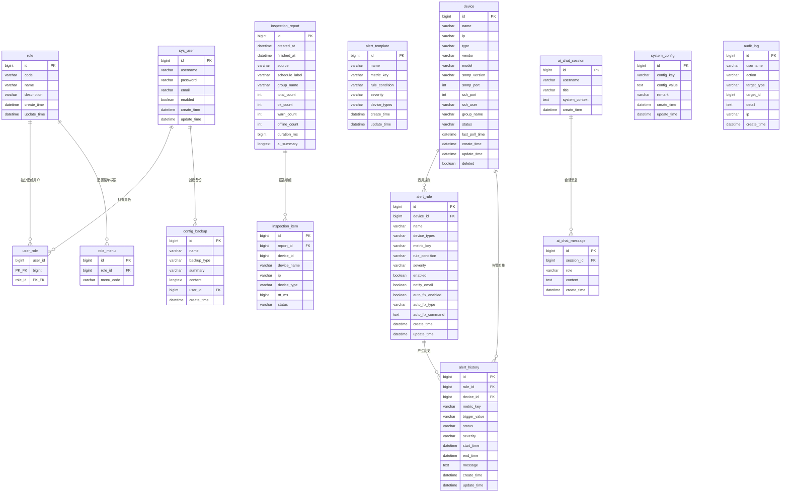

# NetPulse 全局 E-R 图（含关系与属性）

本文档提供可直接用于论文的 E-R 图源，包含：
- 实体属性（主键/关键字段）
- 实体关系（基数）
- 关系属性说明（通过中间表或关系字段体现）

---

## 1) Mermaid ER 图（全局实体 + 属性 + 关系）

---

## 2) 关系属性说明（论文可直接引用）

> 说明：本系统多数“关系属性”通过中间表字段或历史表字段承载，而非单独 Relationship 表。

| 关系 | 基数 | 关系属性承载位置 | 关系属性（示例） |
|------|------|------------------|------------------|
| 用户 — 角色 | M:N | `user_role` | `user_id`, `role_id`（联合主键） |
| 角色 — 菜单 | 1:N | `role_menu` | `role_id`, `menu_code` |
| 设备 — 告警规则 | 1:N（规则侧可按设备/类型） | `alert_rule` | `device_id`, `device_types`, `metric_key`, `rule_condition` |
| 告警规则 — 告警历史 | 1:N | `alert_history` | `rule_id`, `trigger_value`, `status`, `start_time`, `end_time` |
| 设备 — 告警历史 | 1:N | `alert_history` | `device_id`, `severity`, `message` |
| 巡检报告 — 巡检明细 | 1:N | `inspection_item` | `report_id`, `device_id`, `rtt_ms`, `status` |
| AI会话 — AI消息 | 1:N | `ai_chat_message` | `session_id`, `role`, `content`, `create_time` |
| 用户 — 配置备份 | 1:N | `config_backup` | `user_id`, `backup_type`, `summary`, `create_time` |

---

## 3) 全局实体覆盖范围（用于答辩说明）

- 认证授权域：`sys_user`、`role`、`user_role`、`role_menu`
- 设备监控域：`device`、`alert_rule`、`alert_history`、`alert_template`
- 巡检与 AI 域：`inspection_report`、`inspection_item`、`ai_chat_session`、`ai_chat_message`
- 系统治理域：`system_config`、`config_backup`、`audit_log`

---

## 4) 论文插图建议

- 若正文版面有限，建议保留上方 Mermaid 图并将“关系属性说明表”作为图后文字说明。  
- 若答辩或附录需要详细展示，可同时引用：
  - `docs/全局ER图-含属性.md`（全量属性版）
  - `docs/论文-数据库图示专篇-ER与表结构图.md`（数据库专篇）

