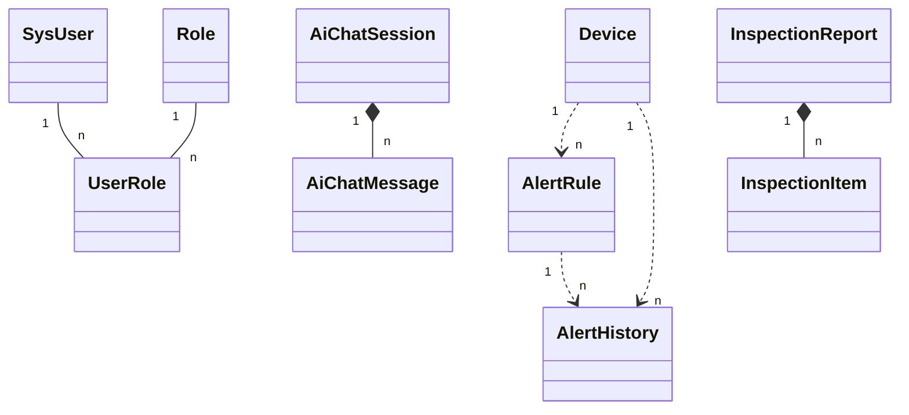
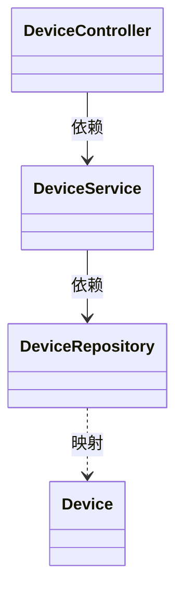

# NetPulse 类图（论文用）

本目录提供 **领域实体类图**、**后端分层类图** 的 PlantUML 源文件，以及 **Mermaid** 精简版，便于导出 PNG/SVG 插入 Word。

## 毕业设计论文如何选用

| 用途 | 推荐源文件 | 说明 |
|------|------------|------|
| **仅画了实体类、缺少 Controller/Service 时的补充** | `NetPulse-类图-四层分层-与实体图配套.puml` | **四包纵向**：Controller → Service → Repository → Entity，类量适中、线条清晰；与 **`NetPulse-类图-领域实体.puml`** 同章并置时，题注需区分「领域模型」与「分层依赖」两种视角。 |
| **正文主图（全系统后端分层一览）** | `NetPulse-类图-论文新版-分层.puml` | 双区（应用层 / 数据层）整合，类全、关系全，适合 **第 4 章系统设计** 中「核心类与分层」总述；题注示例：**图4-x NetPulse 后端核心类图（分层结构）**。 |
| **正文补充或附录（教材式三栏 + 编号）** | `NetPulse-类图-范文格式-论文用.puml` | ①②③ 与【类型说明】、属性/方法三栏，按 **设备 / 巡检 / AI** 三模块展开，与常见课程设计范文体例一致；题注示例：**图4-x 典型子系统类图（范文格式）**。 |
| **强调领域实体与关联** | `NetPulse-类图-UML规范-论文用.puml` 或 `NetPulse-类图-领域实体.puml` | 突出 **实体、多重性、组合**，可与分层类图配合使用，避免单张图职责过多。 |

**排版建议**：正文优先 **1 张总览分层图**；若篇幅允许，可增加 **1 张范文格式子系统图** 或放入 **附录**。导出 **SVG**（Word 缩放清晰）或 **300dpi PNG**；图注中简要说明「应用层含 Controller 与全部 Service」等与图中 Legend 一致。

---

| 文件 | 内容 |
|------|------|
| **`docs/NetPulse-类图-完整-全关系说明.puml`** | **完整四层 + 关系用途说明**：控制层 / WebSocket / 业务服务 / 仓储 / 实体全覆盖；**每条依赖旁中文写清「为何使用」**；与 Spring 注入大体一致；Influx/Redis/OSHI 等见图中说明 Note |
| **`docs/NetPulse-类图-论文新版-分层.puml`** | **新版推荐（2026）**：**双区整合**——仅 **应用层（控制器+全部服务）** 与 **数据层（仓储+实体）** 两包，避免多格分散；**类框为「中文名 + 英文类名」**；**关系线旁中文标注**；含 WebSocket 终端 |
| **`docs/NetPulse-类图-关键类-极简版-论文用.puml`** | **正文速读首选**：仅保留主链路关键类（控制器/服务/核心仓储/核心实体），黑白、线少、单页一眼看懂；适合毕业论文正文“关键类说明” |
| **`docs/NetPulse-类图-关键类-极简版-论文用.drawio`** | 与上同内容的 **draw.io 可编辑版**：黑白、关键类、单页；可在 draw.io 中直接拖拽微调字号与位置 |
| **`docs/NetPulse-类图-范文格式-论文用.puml`** | **范文体例·单页版**：三列 **互不连线**（避免线条交叉）；列内 **控制→业务→仓储→实体** 自上而下；**共用服务从略**（见 Legend）；`scale max 1100`、`ortho` 折线，便于 **一页排版** |
| **`docs/NetPulse-类图-中心辐射-模板风-论文用.puml`** | **他人模板同款结构**：左侧 **统一入口 Hub**，右侧 **纵向 6 个 Manager**，箭头辐射、**线上中文**（用户管理、设备监控…）；类名为概念聚合，与教材「中心调度—子模块」一致；实现级类图仍见分层版 |
| **`docs/NetPulse-类图-参考风格-设备管理.puml`** | **参考图同款风格**：少量核心类、接口/实现分离、三栏详细方法（设备管理子系统） |
| **`docs/NetPulse-类图-全量分层-论文用.puml`** | **上一版全量分层**：Controller / Service / Repository / Entity（无 WebSocket 独立包） |
| **`docs/NetPulse-类图-模板风格-论文用.puml`** | **模板风格类图**：仿常见论文样式（实体类/接口类/实现类/控制器类，左右分布、三栏展示） |
| **`docs/NetPulse-类图-UML规范-论文用.puml`** | **教材式 UML 类图**：三栏（类名、属性、方法），含关联、组合及多重性说明，与正文「类图用于描述静态结构」一致 |
| **`docs/NetPulse-类图-核心业务-完整版.puml`** | **新增**：核心业务类图完整版（非精简，覆盖全部核心实体，保证每个类有关系表示） |
| `docs/NetPulse-类图-核心业务-精简版.puml` | 旧文件名（已不推荐）；内容可作为完整版排版参考 |
| `docs/NetPulse-类图-领域实体.puml` | JPA 核心实体及用户/设备/告警/AI/巡检/审计等关联（简化字段） |
| **`docs/NetPulse-类图-论文指定四层类图.puml`** | **UML 逻辑分层**：仅题目给定类名 + «Controller/Service/Repository/Entity»；不展开属性方法、不写实现类名；`AlertHistory` 通过 `AlertService` 维护语义与实体关联表达 |
| **`docs/NetPulse-类图-四层分层-与实体图配套.puml`** | **与实体图配套**：四包明确分层 + 典型依赖；含 **AlarmRulesController → Repository** 薄 CRUD |
| `docs/NetPulse-类图-后端分层.puml` | Controller → Service → Repository → Entity 分层示意（设备单链示例） |
| `docs/NetPulse-类图-分层示意.drawio` | draw.io 设备模块纵向依赖（与论文图示全量合并） |
| `docs/论文-类图-Mermaid合集.md` | 分模块 Mermaid `classDiagram`（设备、告警、AI 等） |

---

## 与教材 UML 类图说明的对应关系

- **类**：用矩形表示；**三栏**自上而下为类名、属性、方法（见 `NetPulse-类图-UML规范-论文用.puml`）。
- **关系**：本图中 **实线** 表示关联（多对多、一对多等）；**组合** 用 `*--`（组合强，如会话—消息、报告—明细）；**依赖** 用 `..>`（如用户与审计日志通过用户名关联）。
- **继承**：本系统采用 **用户—角色—多对多**，未采用「管理员/普通用户」泛化子类，故图注中说明与招聘类示例图不同。

---

## 导出方式

- **PlantUML**：在 VS Code 安装 PlantUML 插件，或使用 <https://www.plantuml.com/plantuml> 在线渲染，导出 PNG/SVG。
- **Mermaid**：将下节代码或 `论文-类图-Mermaid合集.md` 中代码块复制到 [mermaid.live](https://mermaid.live) 导出。

---

## Mermaid 精简：领域实体关联（与 `NetPulse-类图-领域实体.puml` 对应）

---

## Mermaid 精简：后端分层（与 `NetPulse-类图-后端分层.puml` 对应）

更多接口方法、属性列表见 `论文-类图-Mermaid合集.md` 各节展开图。
