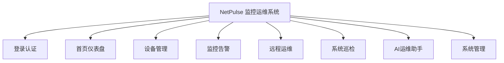
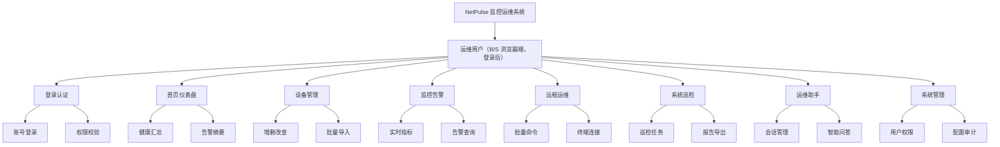

# NetPulse 系统功能图（二级结构）

按你的最新要求，系统功能图改为 **二级**：

1. **第一层**：系统总目标  
   - NetPulse 监控运维系统
2. **第二层**：功能模块  
   - 登录认证、首页仪表盘、设备管理、监控告警、远程运维、系统巡检、AI运维助手、系统管理

---

## draw.io 文件

- `docs/NetPulse-系统功能图.drawio`

---

## Mermaid 对应（二级）

---

## 说明

- `docs/NetPulse-系统功能图.drawio`：二级结构。  
- `docs/NetPulse-系统模块图.drawio`：竖版模块图（自上而下）。
# NetPulse 系统功能图（功能分解图样式）

与常见 **功能分解图** 一致：**系统名（横）→ 角色层（横）→ 八个主功能模块（竖排窄框）→ 每模块下两项子功能（竖排窄框）**。  
**draw.io 竖排版式**：`docs/NetPulse-系统功能图.drawio`（论文插图优先用此文件导出 PNG/SVG）。

---

## 结构说明

| 层级 | 内容 |
|------|------|
| 第一层 | NetPulse 监控运维系统 |
| 第二层 | 运维用户（B/S 浏览器端，登录后） |
| 第三层 | 登录认证、首页仪表盘、设备管理、监控告警、远程运维、系统巡检、运维助手、系统管理 |
| 第四层 | 每模块 **2** 项子功能（与参考「线超」类分解图一致） |

---

## Mermaid 逻辑树（文字横排；竖排以 draw.io 为准）

---

## 子功能与实现对应（简述）

- **终端连接**：Web SSH / Telnet（`/ssh/...`）。
- **配置审计**：系统设置、配置备份、操作日志等（`/system`、`/backup`、`/audit`）。
- **运维助手**：对应前端 AI 运维助手与大模型调用。

---

## 一级模块与路由对照

| 第三层模块 | 主要路由 / 入口 |
|------------|-----------------|
| 登录认证 | `/login` |
| 首页仪表盘 | `/dashboard` |
| 设备管理 | `/devices` |
| 监控告警 | `/metrics`、`/topology`、`/alerts` |
| 远程运维 | `/batch-command`、`/network-ai-command`、`/ssh/...` |
| 系统巡检 | `/inspection` |
| 运维助手 | `/ai-assistant` |
| 系统管理 | `/users`、`/system`、`/backup`、`/audit` |
