# NetPulse 系统模块图（树状结构）

## 文本树（论文可直接引用）

```text
监控运维系统
├─ 登录认证
│  ├─ 账号密码登录
│  └─ 会话与权限校验
├─ 首页仪表盘
│  ├─ 设备健康汇总
│  ├─ 在线/离线统计
│  ├─ 告警摘要
│  └─ 设备类型分布
├─ 设备管理
│  ├─ 设备列表与增删改查
│  ├─ 设备拓扑
│  └─ Ping与连通性
├─ 监控与告警
│  ├─ 实时指标
│  ├─ 告警规则
│  ├─ 告警历史
│  └─ 邮件通知
├─ 远程运维
│  ├─ Linux运维控制台
│  ├─ 网络设备运维控制台
│  └─ Web SSH
├─ 系统巡检
│  ├─ 定时巡检
│  ├─ 巡检任务报告
│  └─ 巡检报告PDF导出
├─ AI运维助手
│  ├─ 会话与历史消息
│  ├─ 设备与监控上下文
│  └─ 大模型问答
└─ 系统管理
   ├─ 用户与角色权限
   ├─ 系统设置
   ├─ 配置备份与恢复
   └─ 操作审计
```

## Mermaid 树图（可导出 PNG/SVG）

```mermaid
flowchart TB
    S[监控运维系统]

    S --> A[登录认证]
    A --> A1[账号密码登录]
    A --> A2[会话与权限校验]

    S --> B[首页仪表盘]
    B --> B1[设备健康汇总]
    B --> B2[在线/离线统计]
    B --> B3[告警摘要]
    B --> B4[设备类型分布]

    S --> C[设备管理]
    C --> C1[设备列表与增删改查]
    C --> C2[设备拓扑]
    C --> C3[Ping与连通性]

    S --> D[监控与告警]
    D --> D1[实时指标]
    D --> D2[告警规则]
    D --> D3[告警历史]
    D --> D4[邮件通知]

    S --> E[远程运维]
    E --> E1[Linux运维控制台]
    E --> E2[网络设备运维控制台]
    E --> E3[Web SSH]

    S --> F[系统巡检]
    F --> F1[定时巡检]
    F --> F2[巡检任务报告]
    F --> F3[巡检报告PDF导出]

    S --> G[AI运维助手]
    G --> G1[会话与历史消息]
    G --> G2[设备与监控上下文]
    G --> G3[大模型问答]

    S --> H[系统管理]
    H --> H1[用户与角色权限]
    H --> H2[系统设置]
    H --> H3[配置备份与恢复]
    H --> H4[操作审计]
```



