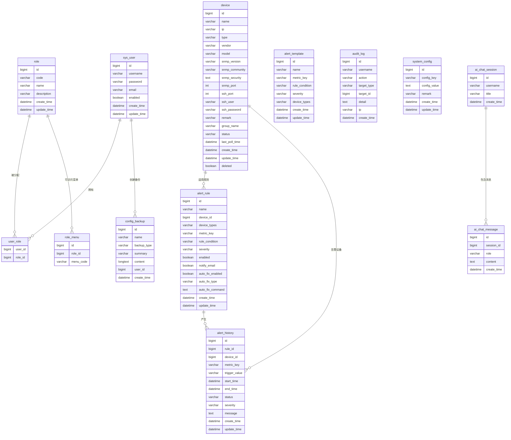
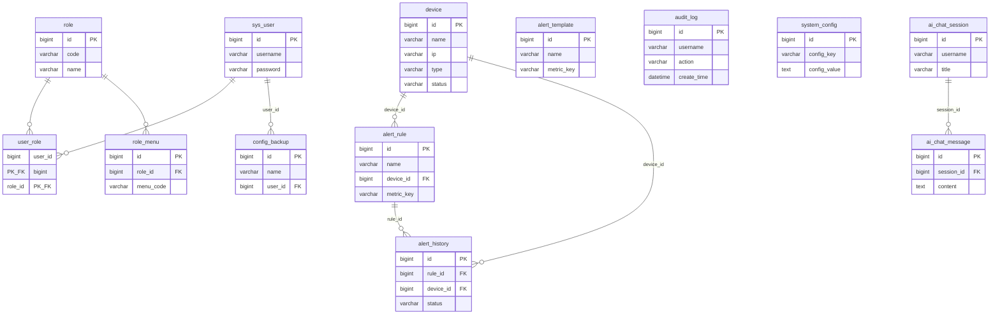

# NetPulse 全局 E-R 图（含属性）

本文档提供**包含属性**的全局 E-R 图，与当前后端实际使用的表一致（已剔除已删除表 monitor_item、webssh_session、notification_log、user_menu 等）。  
可在支持 Mermaid 的编辑器中预览，或使用 [mermaid.live](https://mermaid.live) 导出 PNG/SVG。

---

## 一、Mermaid 源代（含属性）

---

## 二、简化版（仅主键与关键属性，便于大图排版）

若图过大可改用本简化版，只保留主键与 1～2 个关键业务属性：

---

## 三、实体与关系说明（供手绘或 Visio 对照）

| 实体 | 主键 | 主要属性 | 关系 |
|------|------|----------|------|
| sys_user | id | username, password, email, enabled, create_time, update_time | 与 role 多对多（经 user_role）；与 config_backup 一对多 |
| role | id | code, name, description, create_time, update_time | 与 sys_user 多对多（经 user_role）；与 role_menu 一对多 |
| user_role | user_id, role_id | 联合主键 | 关联 sys_user 与 role |
| role_menu | id | role_id, menu_code | 多对一 role |
| device | id | name, ip, type, vendor, model, ssh_*, snmp_*, status, group_name, last_poll_time, deleted, create_time, update_time | 与 alert_rule、alert_history 一对多 |
| alert_rule | id | name, device_id, device_types, metric_key, rule_condition, severity, enabled, auto_fix_*, create_time, update_time | 多对一 device；与 alert_history 一对多 |
| alert_history | id | rule_id, device_id, metric_key, trigger_value, start_time, end_time, status, severity, message, create_time, update_time | 多对一 alert_rule、device |
| alert_template | id | name, metric_key, rule_condition, severity, device_types, create_time, update_time | 独立表 |
| audit_log | id | username, action, target_type, target_id, detail, ip, create_time | 独立表（逻辑上按 username 关联用户） |
| system_config | id | config_key, config_value, remark, create_time, update_time | 独立表 |
| config_backup | id | name, backup_type, summary, content, user_id, create_time | 多对一 sys_user（user_id） |
| ai_chat_session | id | username, title, create_time | 与 ai_chat_message 一对多 |
| ai_chat_message | id | session_id, role, content, create_time | 多对一 ai_chat_session |

---

## 四、导出说明

- **VS Code**：安装 Mermaid 插件后打开本文件预览。
- **在线导出**：将上面任一代码块内容（不含 \`\`\`mermaid 标记）复制到 [mermaid.live](https://mermaid.live) 中，可导出 PNG/SVG。
- **论文插图**：若 Mermaid 渲染后实体框内文字过密，可使用「二、简化版」或按「三、实体与关系说明」在 Visio/draw.io 中手绘，并保留主键与关键属性。
