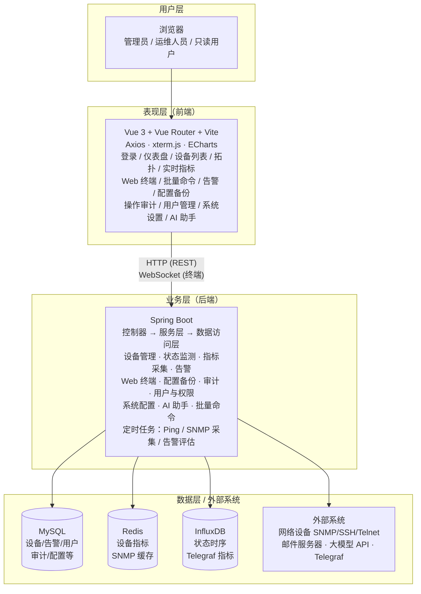
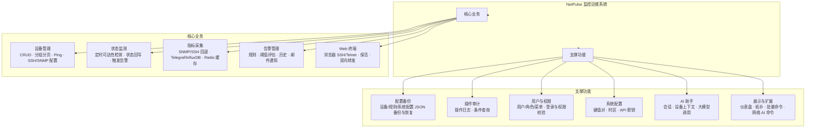
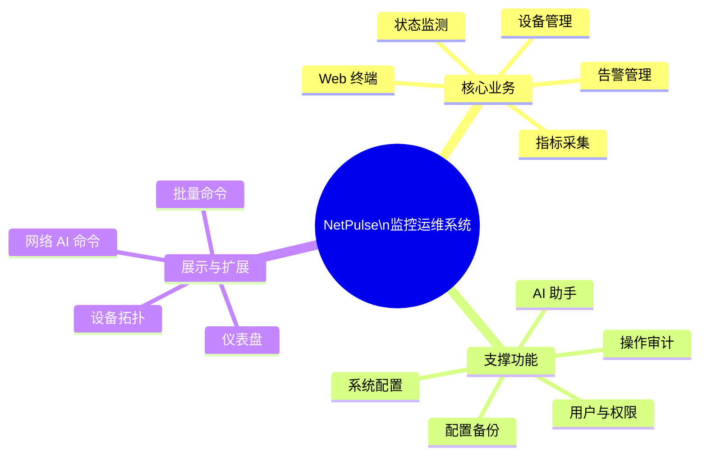
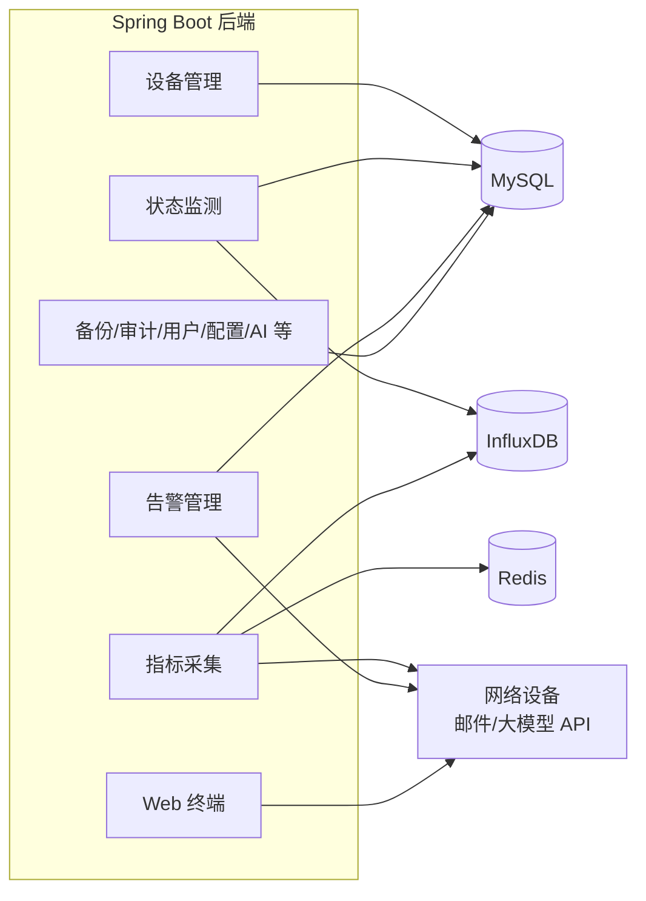

# NetPulse 系统功能架构图

本文档提供**可直接渲染**的系统功能架构图（Mermaid），可用于论文插图、答辩 PPT 或导出为 PNG/SVG。  
在支持 Mermaid 的编辑器中（如 VS Code 插件、Typora、GitHub）可预览；也可用 [Mermaid Live Editor](https://mermaid.live) 粘贴代码导出图片。

---

## 一、总体架构图（分层）

系统采用**前后端分离 B/S 架构**：用户层 → 表现层（前端）→ 业务层（后端）→ 数据层 / 外部系统。

---

## 二、功能模块架构图

按**功能**划分的模块，中心为系统名称，周围为各功能子模块。

---

## 三、功能模块关系图（简化版）

仅展示模块名称与归属，便于快速绘制或插入 PPT。

---

## 四、后端与数据流简图

后端各功能与 MySQL / Redis / InfluxDB / 外部设备的交互关系。

---

## 五、绘图与导出说明

| 方式 | 说明 |
|------|------|
| **VS Code** | 安装 “Mermaid” 或 “Markdown Preview Mermaid Support” 插件，在预览中查看。 |
| **在线导出** | 复制对应代码块内容（不含 \`\`\`mermaid 标记）到 [mermaid.live](https://mermaid.live)，可导出 PNG/SVG。 |
| **论文/PPT** | 从 Mermaid Live 导出 PNG 或 SVG 后插入 Word/PPT；或按 `docs/系统功能架构图说明.md` 中的文字框图在 Visio/draw.io 中重绘。 |

若学校要求“系统功能架构图”为单独一张图，推荐使用**第二节「功能模块架构图」**或**第三节「功能模块关系图」**导出为图片后提交。
