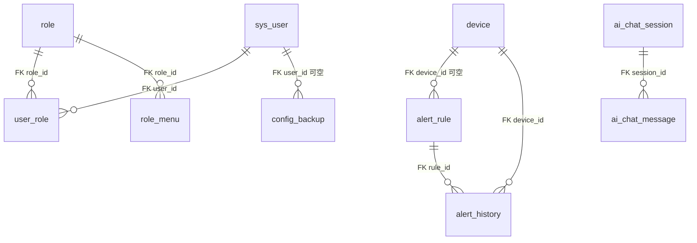
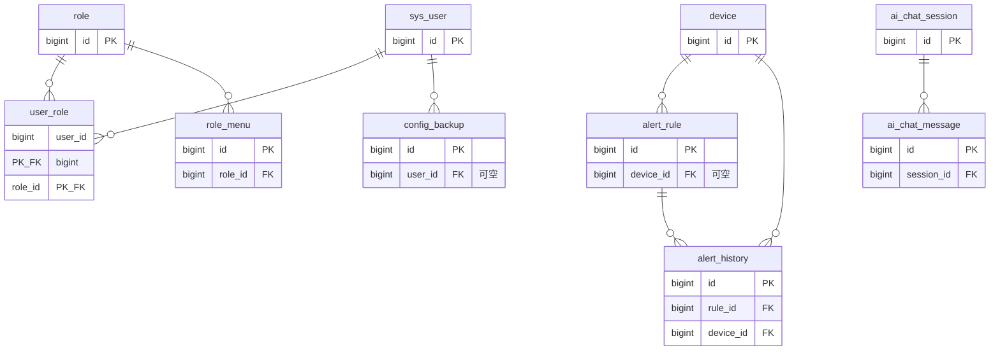

# NetPulse 数据库 E-R：**实体关系**说明（论文用）

本文只强调**谁与谁关联、基数（1:1 / 1:N / M:N）、外键字段**，便于写「数据库概念设计」小节与画 ER 连线标注。

---

## 一、关系总表（推荐直接放进论文表 4-x）

| 序号 | 父实体（一） | 子实体（多） | 基数 | 外键 / 关联字段 | 说明 |
|------|--------------|--------------|------|-----------------|------|
| R1 | sys_user | user_role | 1 : N | user_role.user_id → sys_user.id | 一用户可有多角色行 |
| R2 | role | user_role | 1 : N | user_role.role_id → role.id | 一角色可被多用户引用 |
| R3 | sys_user ↔ role | user_role | **M : N** | 由 R1、R2 联合体现 | **中间表** user_role |
| R4 | role | role_menu | 1 : N | role_menu.role_id → role.id | **独立表**存 menu_code，与「角色」分表，非合并 |
| R5 | device | alert_rule | 1 : N（可选） | alert_rule.device_id → device.id，**可 NULL** | 空则按 device_types 等匹配多台设备 |
| R6 | device | alert_history | 1 : N | alert_history.device_id → device.id | 每条历史对应一台设备 |
| R7 | alert_rule | alert_history | 1 : N | alert_history.rule_id → alert_rule.id | 每条历史对应一条规则 |
| R8 | sys_user | config_backup | 1 : N（可选） | config_backup.user_id → sys_user.id，**可 NULL** | 记录谁发起的备份 |
| R9 | ai_chat_session | ai_chat_message | 1 : N | ai_chat_message.session_id → ai_chat_session.id | 会话下多条消息 |
| — | alert_template | （无） | 独立表 | 无外键 | 供创建规则时作模板，不与运行时表强制关联 |
| — | audit_log | （无物理 FK） | 逻辑关联 | audit_log.username 与 sys_user.username 对应 | 便于审计，不设库级外键 |
| — | system_config | （无） | 独立表 | — | 键值配置 |

---

## 二、Mermaid：仅画**关系连线**（无属性，图最清晰）

适合论文「关系图」单页；导出： [mermaid.live](https://mermaid.live) → PNG/SVG。

**重要**：**角色表 `role` 与 菜单权限表 `role_menu` 是两张表**，通过 `role_menu.role_id` 关联；**不是**「角色与菜单合并成一张表」。用户—角色多对多由 **user_role** 中间表承担。

**符号说明（Mermaid 语法）**：

- `||--o{`：一侧「一」、一侧「多」（1 : N）
- **user_role**：分别与 **sys_user**、**role** 各形成 1:N，两行外键共同表达 **用户—角色 M:N**
- **role_menu**：仅与 **role** 有外键；**menu_code** 为列，无独立「菜单表」时仍是一张独立关联表

---

## 三、Mermaid：关系 + 主键缩写（稍密，仍可读）

---

## 四、基数用文字怎么写（答辩/论文一句版）

- **用户—角色**：多对多，**分解**为两个一对多指向中间表 `user_role`（联合主键 user_id + role_id）。  
- **角色—菜单**：一对多（一个角色对应多条 `role_menu.menu_code`）。  
- **设备—告警规则**：一对多；`device_id` 为空时表示不绑定单台设备，按类型等规则匹配。  
- **设备、规则—告警历史**：历史记录同时引用 `device_id` 与 `rule_id`，分别多对一到设备与规则。  
- **用户—配置备份**：一对多，操作人可空。  
- **AI 会话—消息**：标准一对多父子表。

---

## 五、与仓库其他文件对应

| 文件 | 内容 |
|------|------|
| `全局ER图-含属性.md` | 含**全部字段**的 ER |
| `论文-数据库图示专篇-ER与表结构图.md` | 分模块 ER + 表框图 |
| `NetPulse-全局ER图.drawio` | draw.io **紧凑版**：左「用户+设备告警」、右「系统/审计/AI」两列集中，带分组底色，连线不分散 |
| `后端与数据库表结构对照.md` | 字段级与库表核对 |
