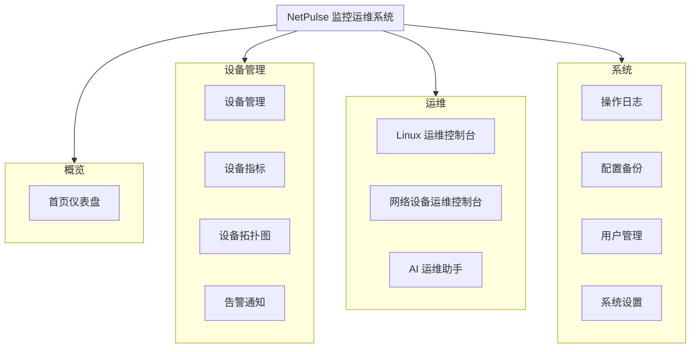
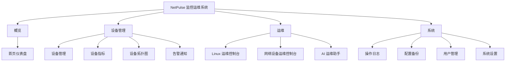
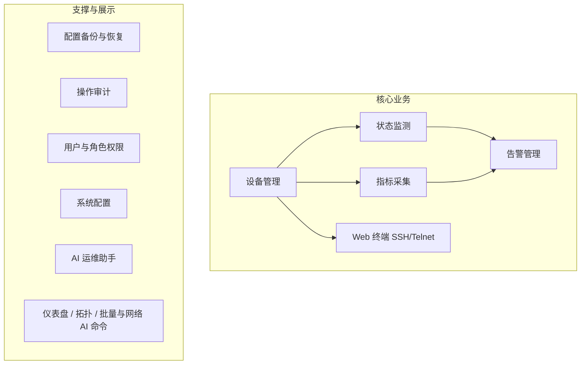

# NetPulse 系统功能模块图（论文插图）

与 **前端侧栏菜单**（`Layout.vue` 中 `menuList`）及业务划分一致，便于写「系统功能结构」章节。  
图均为 **Mermaid**，复制到 [mermaid.live](https://mermaid.live) 可导出 PNG/SVG。**draw.io 版**：`docs/NetPulse-功能模块图.drawio`。

---

## 一、按菜单分组的功能模块（推荐用于论文，与界面一致）

**更紧凑的一页版（自上而下树形）**：

---

## 二、业务视角：核心功能 vs 支撑功能

与《系统功能架构图》第二节一致，突出**监控运维闭环**与**安全与扩展**。

---

## 三、功能模块与主要能力对照（论文表 3-x 素材）

| 模块（菜单名） | 主要能力 |
|----------------|----------|
| 首页仪表盘 | 设备健康汇总、在线/离线趋势、类型分布、告警摘要 |
| 设备管理 | 设备 CRUD、分组、Ping、SNMP/SSH 参数、逻辑删除 |
| 设备指标 | Linux（Influx/Telegraf）与网络设备（SNMP/SSH 缓存）实时指标 |
| 设备拓扑图 | 设备关系可视化、按状态筛选 |
| 告警通知 | 告警规则、模板、历史、邮件通知、批量处理 |
| Linux 运维控制台 | 批量 SSH 命令、智能巡检脚本 |
| 网络设备运维控制台 | 网络 AI 辅助命令 |
| AI 运维助手 | 会话、多轮对话、设备上下文、大模型 API |
| 操作日志 | 审计记录查询 |
| 配置备份 | JSON 备份与恢复 |
| 用户管理 | 用户、角色、菜单权限模板 |
| 系统设置 | 时区、API 密钥等键值配置 |

---

## 四、与公开文档索引

| 文档 | 说明 |
|------|------|
| `系统功能架构图.md` | 分层架构、mindmap、后端数据流 |
| `系统功能架构图说明.md` | 文字框图说明 |
| `论文图示汇总-ER图-流程图-数据库表图-架构图.md` | 总索引 |

---

## 五、导出说明

1. 打开 https://mermaid.live  
2. 粘贴某一节 `flowchart` 代码（不含 \`\`\`mermaid）  
3. **Actions → Export PNG/SVG**  
4. 图过大时可只采用「一、按菜单分组」中的**树形版**单张插图。
