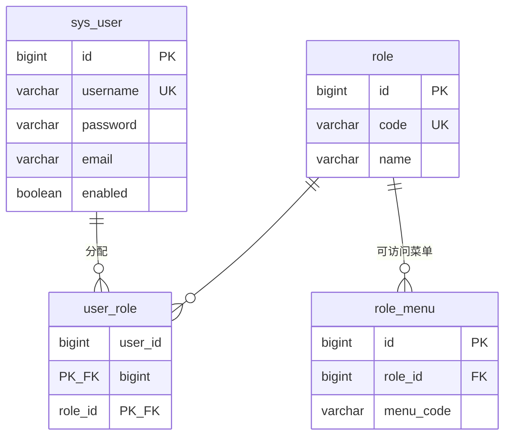
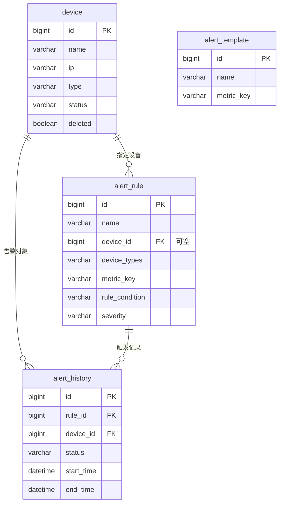
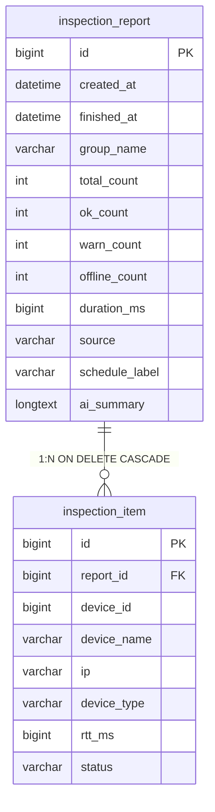
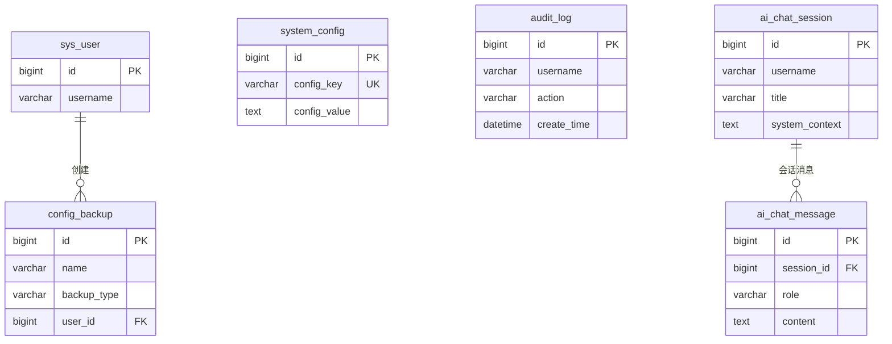
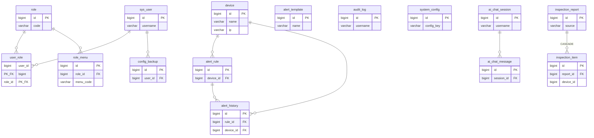
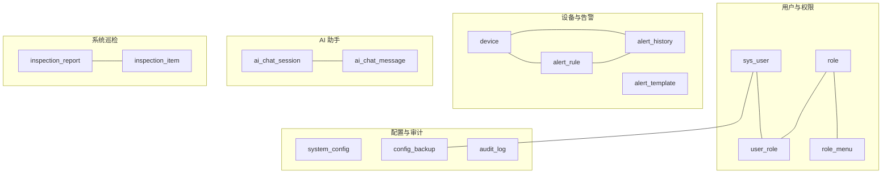
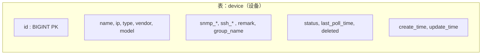
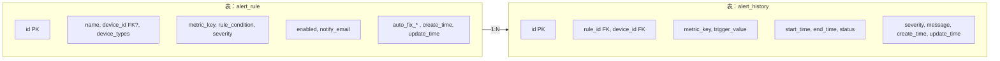
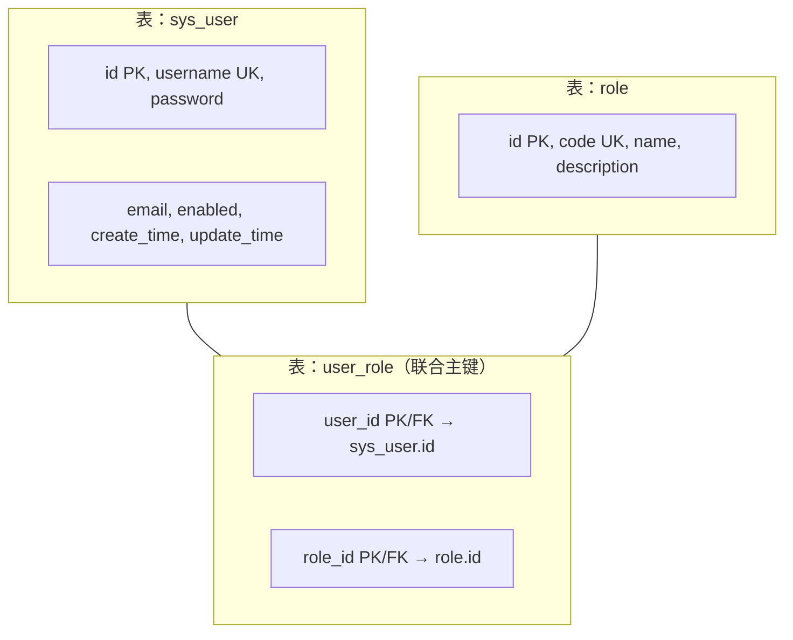
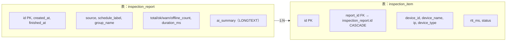

# 论文专用：数据库 E-R 图与表结构图（可直接导出插图）

本文档面向毕业设计论文**第 4 章 数据库设计**插图，与当前 NetPulse 后端 **JPA 实体 / MySQL 表**一致。  
所有图均提供 **Mermaid** 源码，可在 [mermaid.live](https://mermaid.live) 粘贴后导出 **PNG / SVG**，插入 Word 或答辩 PPT。

> 更完整的字段说明见：`后端与数据库表结构对照.md`  
> 全局带属性 ER 见：`全局ER图-含属性.md`  
> 架构与流程图汇总见：`论文图示汇总-ER图-流程图-数据库表图-架构图.md`  
> **表关系图（仅外键/基数）**、**表结构分组框图**见该汇总文档 **「三.1」「四」「四.1」** 节（含 `inspection_report` / `inspection_item`）。

---

## 一、分模块 E-R 图（论文排版推荐：一图一模块，避免单图过大）

### 1.1 用户与权限子系统

**说明**：用户与角色为**多对多**（`user_role` 为中间表）；角色与菜单权限为**一对多**（`role_menu` 存 `menu_code` 字符串）。

---

### 1.2 设备与告警子系统

**说明**：`alert_rule.device_id` 可为空，表示按 `device_types` 等条件匹配多台设备；`alert_template` 为规则模板，与运行时告警**无强制外键**。

---

### 1.3 系统巡检子系统

**说明**：`inspection_item.device_id` 与 `device.id` 业务上一致，**库表未建外键**（论文可写「参照完整性由应用层保证」）。

---

### 1.4 配置、审计与 AI 会话子系统

**说明**：`audit_log` 仅存操作人用户名等字段，**未设**到 `sys_user` 的外键，论文中可写为「逻辑关联用户」。

---

## 二、全局 E-R 图（简化版，适合「总图」一页）

与 `全局ER图-含属性.md` 中「二、简化版」一致，便于与分模块图对照。

---

## 三、数据库「表图」——表关系一览（框图）

用于论文中「各数据表及其关联」示意图，与 `论文图示汇总` 第四节同类，略作排版优化。

---

## 四、核心表「字段级」表结构图（论文表 4-x 配图）

以下用 **flowchart** 模拟「表框 + 主键/外键」，便于与正文中的字段表对照。完整字段仍以 `后端与数据库表结构对照.md` 为准。

### 4.1 设备表 `device`

### 4.2 告警规则表 `alert_rule` 与历史表 `alert_history`

### 4.3 用户与角色关联

### 4.4 巡检报告表 `inspection_report` 与明细表 `inspection_item`

**说明**：`inspection_item.device_id` 与 `device.id` 为业务对应，**库表未建外键**；删除报告时明细行随 `report_id` 级联删除。

---

## 五、论文中可引用的文字说明（复制到正文）

**逻辑模型**：系统业务数据采用 MySQL 存储，主要实体包括用户、角色、设备、告警规则、告警历史、系统配置、配置备份、审计日志、AI 会话与消息，以及**系统巡检报告与巡检明细**等。用户与角色为多对多关系，通过 `user_role` 关联；角色与可访问菜单项通过 `role_menu` 一对多描述。设备与告警规则、告警历史存在一对多联系：一条告警历史记录必对应一条规则与一台设备；告警规则中的 `device_id` 可为空，以支持按设备类型等条件批量匹配。配置备份与创建用户之间为可选外键关联。AI 会话与消息为典型的一对多父子表结构。**巡检报告**与**巡检明细**为一对多；明细中 `device_id` 指向设备主键，逻辑上保证与设备表一致，可不设库级外键以简化迁移与清理。

**非关系库说明**（若论文需写）：设备指标时序数据存储于 InfluxDB，设备指标缓存使用 Redis，二者不作为本 E-R 图组成部分，在架构图中单独说明。

---

## 六、导出与排版建议

| 步骤 | 说明 |
|------|------|
| 1 | 打开 https://mermaid.live |
| 2 | 将本文 **代码块内**（不含 \`\`\`mermaid 行）复制到左侧编辑区 |
| 3 | 右侧预览无误后，Actions → Export PNG 或 SVG |
| 4 | Word：插入 → 图片；图题建议「图 4-x  xxx 子系统 E-R 图」 |
| 5 | 单图过宽时：优先使用「一、分模块」三张图分开展示 |

若学校要求 **Visio / ProcessOn**：以本文「五、文字说明」与 `后端与数据库表结构对照.md` 中字段为据手绘，符号采用：矩形=实体，菱形=关系，连线标基数（1、N）。

---

## 七、与现有文档索引

| 文档 | 用途 |
|------|------|
| `全局ER图-含属性.md` | 单文件含全部属性 ER |
| `后端与数据库表结构对照.md` | 论文章节「表 4-x 字段说明」数据源 |
| `论文图示汇总-ER图-流程图-数据库表图-架构图.md` | 架构图、业务流程图、后端与数据层关系 |
| 本文 | **分模块 ER + 字段级表图 + 正文可引用段落** |
