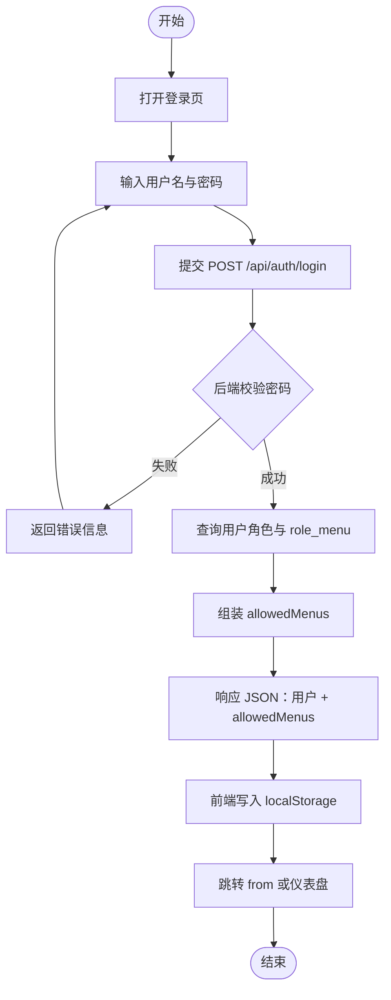
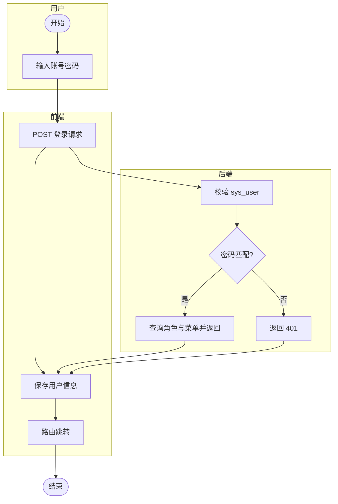
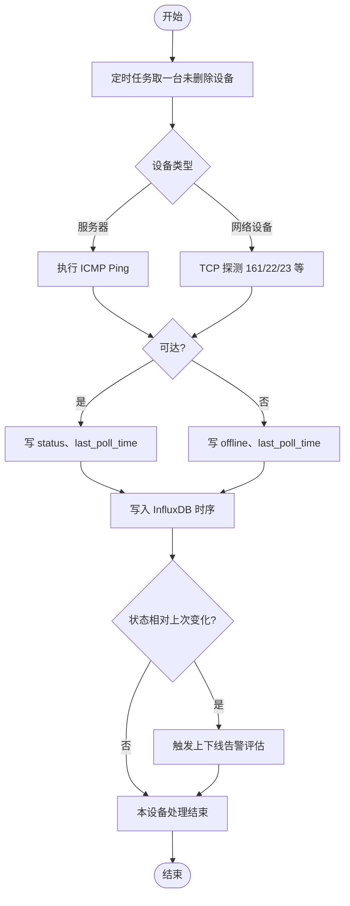
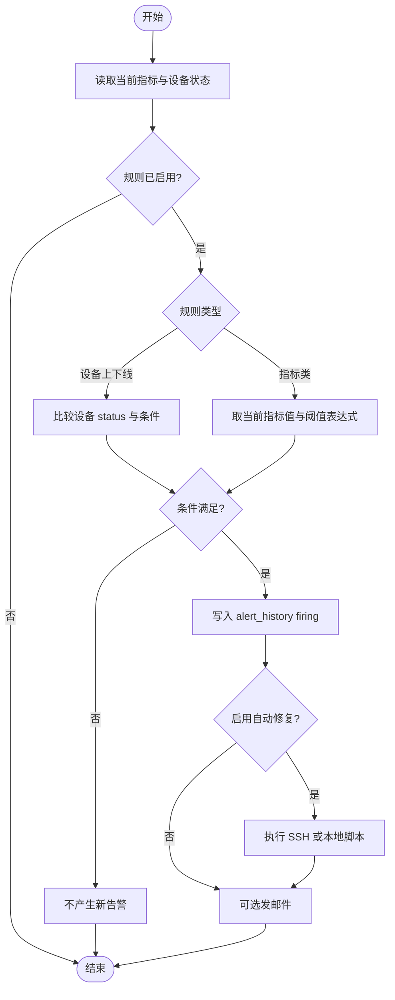
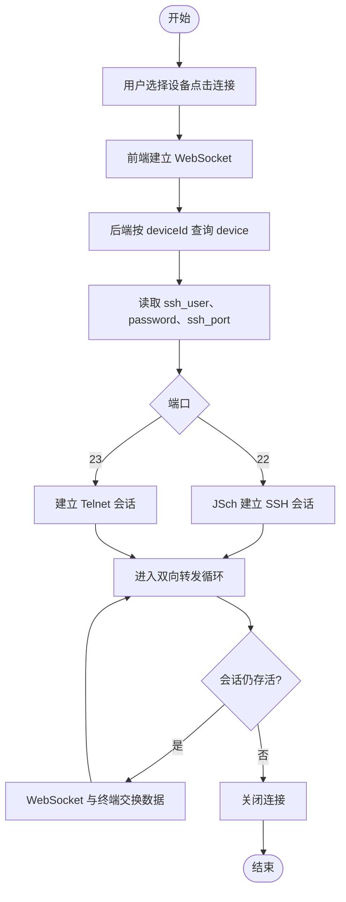
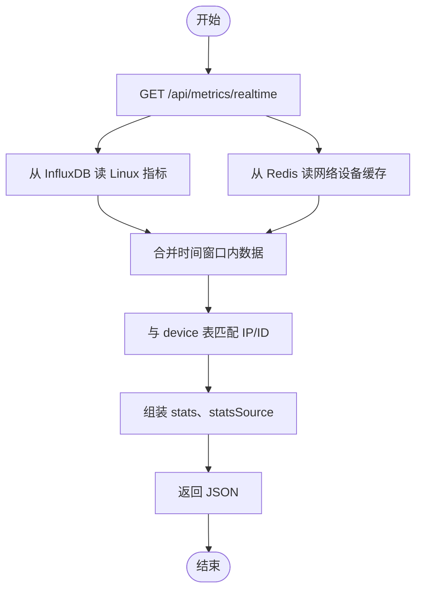
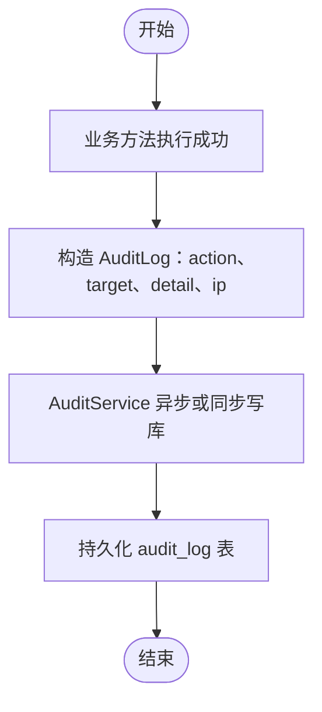

# NetPulse 毕业设计 — 活动图（Mermaid）

活动图描述**控制流**：开始/结束、活动节点、分支与合并、循环。下列使用 Mermaid **flowchart** 语法，节点采用 `([开始/结束])`、矩形活动、`{判断}` 菱形，与 UML 活动图习惯一致。

复制到 [mermaid.live](https://mermaid.live) 可导出 **PNG/SVG** 插入 Word；图内文字可按学校要求改成「图 5-x」说明。

---

## 1 用户登录活动图

**带泳道（用户 / 前端 / 后端）的简化版**：

---

## 2 设备可达性检测活动图（单台设备）

---

## 3 告警规则评估活动图（单条规则一次判定）

---

## 4 Web 终端连接活动图

---

## 5 实时指标查询活动图（后端接口）

---

## 6 操作审计写入活动图（典型写操作）

---

## 与流程图、时序图的区别（论文可写一句）

| 类型 | 侧重 |
|------|------|
| **活动图** | 控制流、分支、循环、谁先做后做 |
| **流程图**（前文） | 与活动图接近，有时不严格区分 |
| **时序图** | 对象间消息先后顺序（可另用 Mermaid `sequenceDiagram` 补充） |

---

## 导出说明

1. https://mermaid.live → 粘贴代码（含 `flowchart TD`）→ **Actions → Export PNG/SVG**  
2. 图过宽：将 `flowchart TD` 改为 `flowchart LR` 或拆成多张图  
3. **draw.io**：插入 → 高级 → **Mermaid**（部分版本支持粘贴 Mermaid）或按本图手绘 UML 活动图符号  

---

## 相关文档

- 业务流程（偏逻辑框图）：`论文-流程图-Mermaid合集.md`  
- 类图：`论文-类图-Mermaid合集.md`  
- 图示总索引：`论文图示汇总-ER图-流程图-数据库表图-架构图.md`
