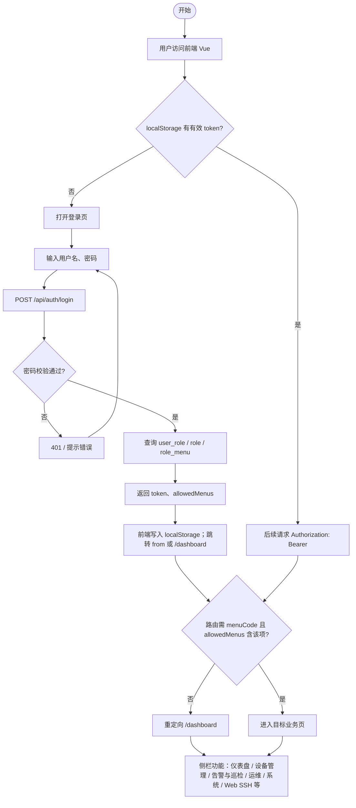
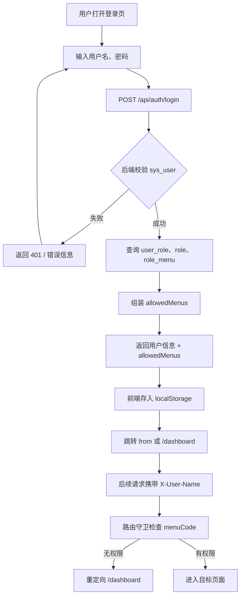
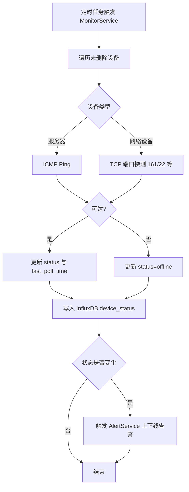
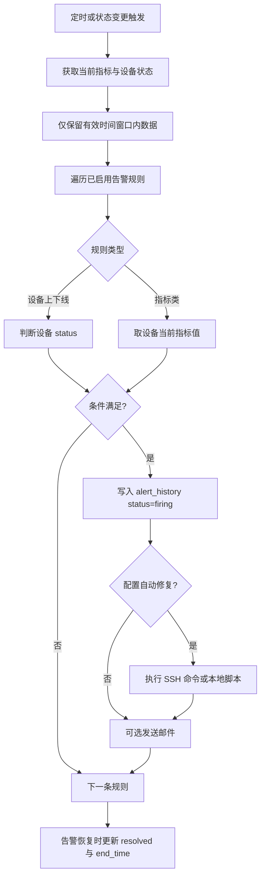
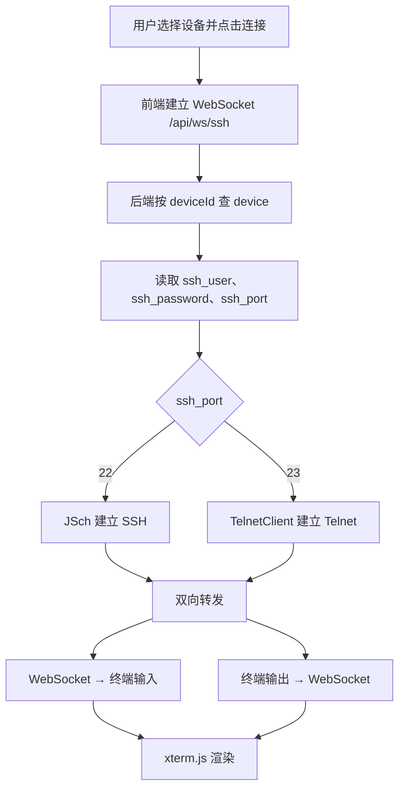
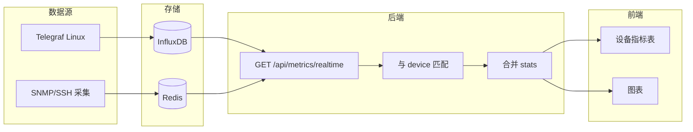
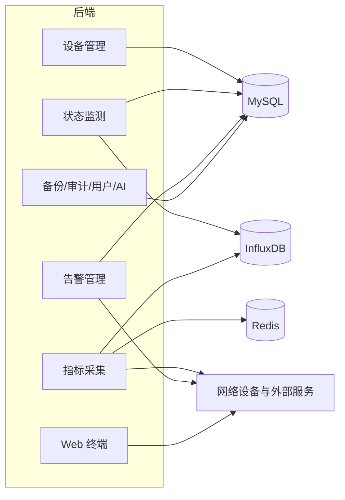
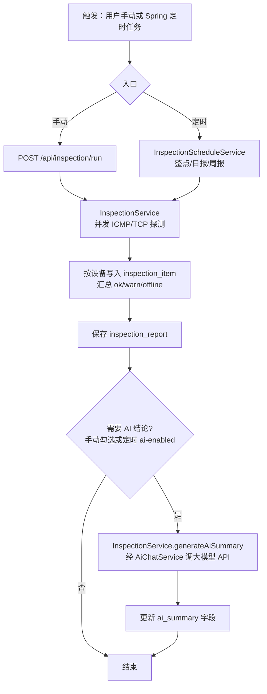

# NetPulse 毕业设计 — 业务流程图（Mermaid 源码）

将下列代码块（**不含**首行 \`\`\`mermaid）复制到 [mermaid.live](https://mermaid.live) 可导出 **PNG / SVG**，插入 Word 或 PPT。  

**draw.io（推荐）**  
- **`NetPulse-功能流程图-完整版.drawio`**：第 **0 页为「系统功能全流程（含登录）」**——从访问前端、token 分支、登录校验、路由权限到侧栏各业务入口与后台支撑；第 1～5 页为分模块详图。含 **开始/结束椭圆、判断菱形、分支是/否、循环回边**，与下文 Mermaid 一致。  
- `NetPulse-流程图-毕业设计.drawio`：简化竖条版（无菱形），可作备份。

---

## 0 系统功能全流程（含登录与业务入口）

> 与 draw.io 页「0-系统功能全流程（含登录）」对应；论文中可放在「业务流程」节前作总览图。

---

## 1 用户登录与权限校验

---

## 2 设备状态监测

---

## 3 告警规则评估

---

## 4 Web SSH / Telnet 与数据转发

---

## 5 实时指标数据流

---

## 6 后端与数据层（补充）

---

## 7 系统巡检（探测汇总与可选 AI 结论）

与 `InspectionService`、`InspectionScheduleService`、`InspectionController` 及实体 `inspection_report` / `inspection_item` 一致；探测与落库在应用进程内完成。

---

## 导出说明

1. 打开 https://mermaid.live  
2. 粘贴某一节的 flowchart 代码（从 `flowchart` 或 `flowchart TD` 那一行开始到最后）  
3. Actions → Export PNG / SVG  

若图过宽：在代码中把 `flowchart LR` 改为 `flowchart TD` 再导出。
