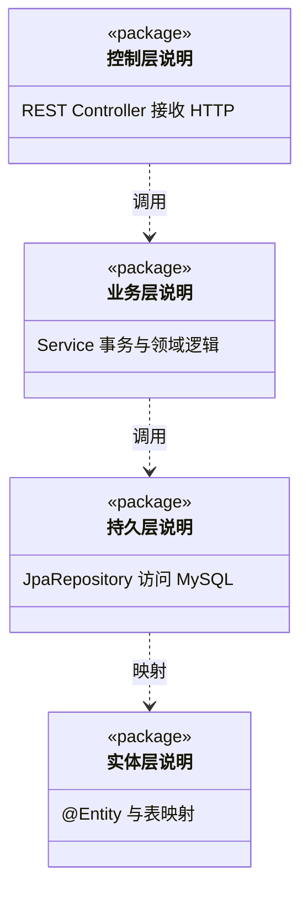
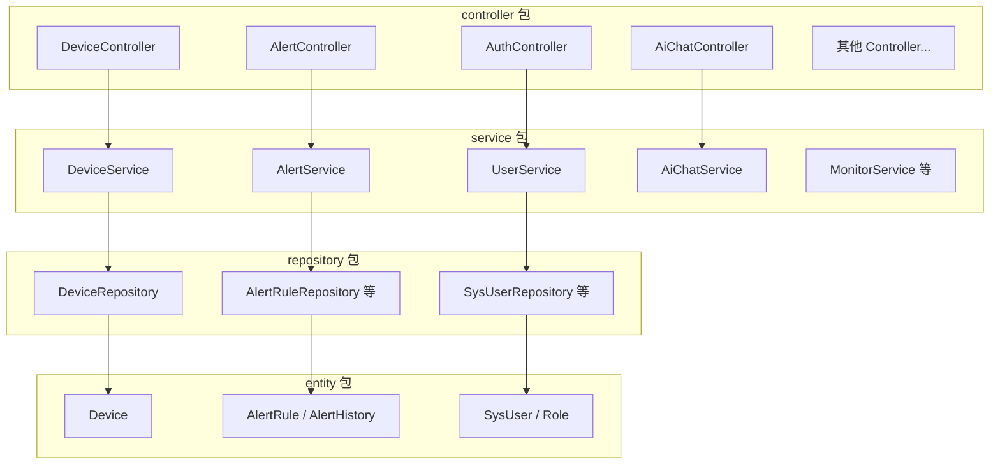
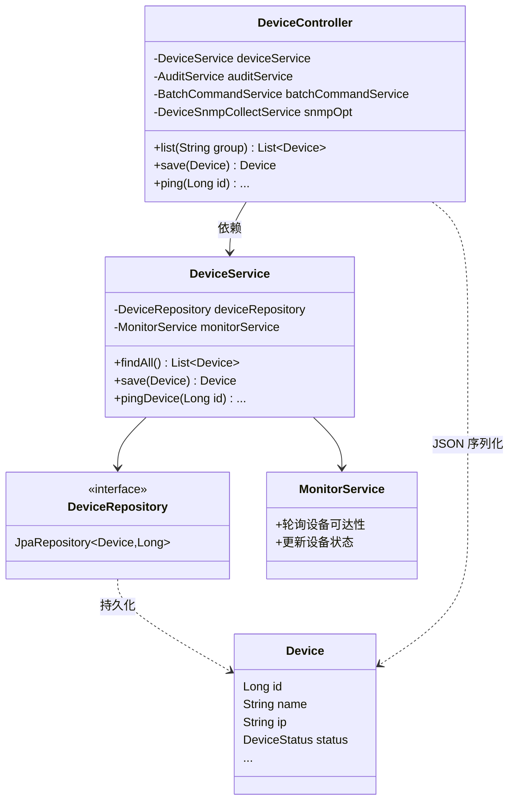
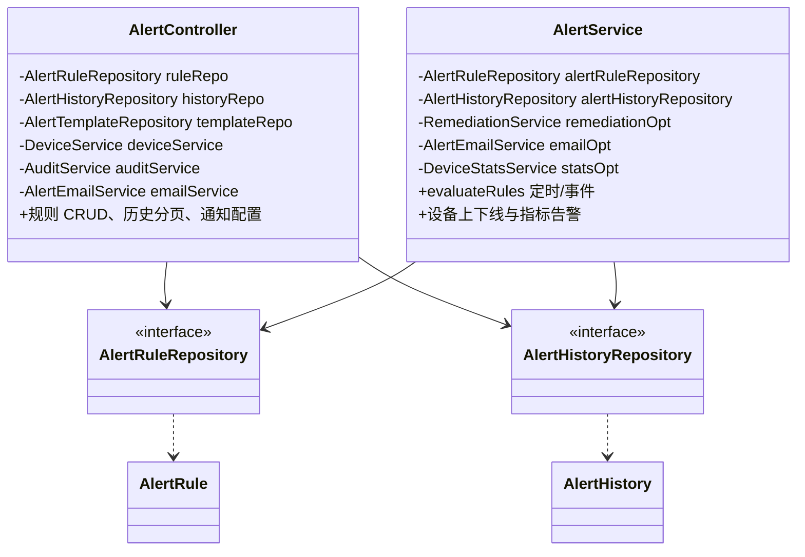
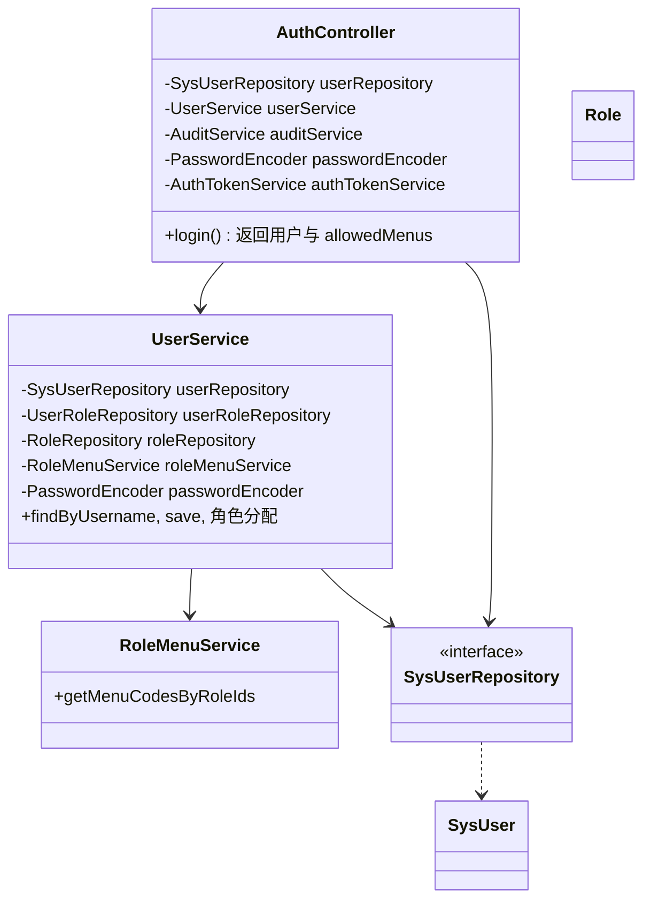
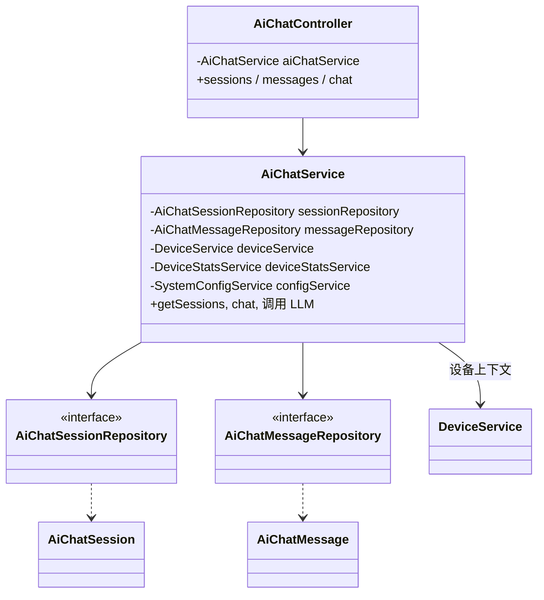
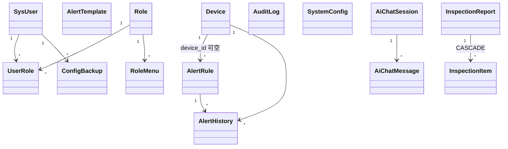
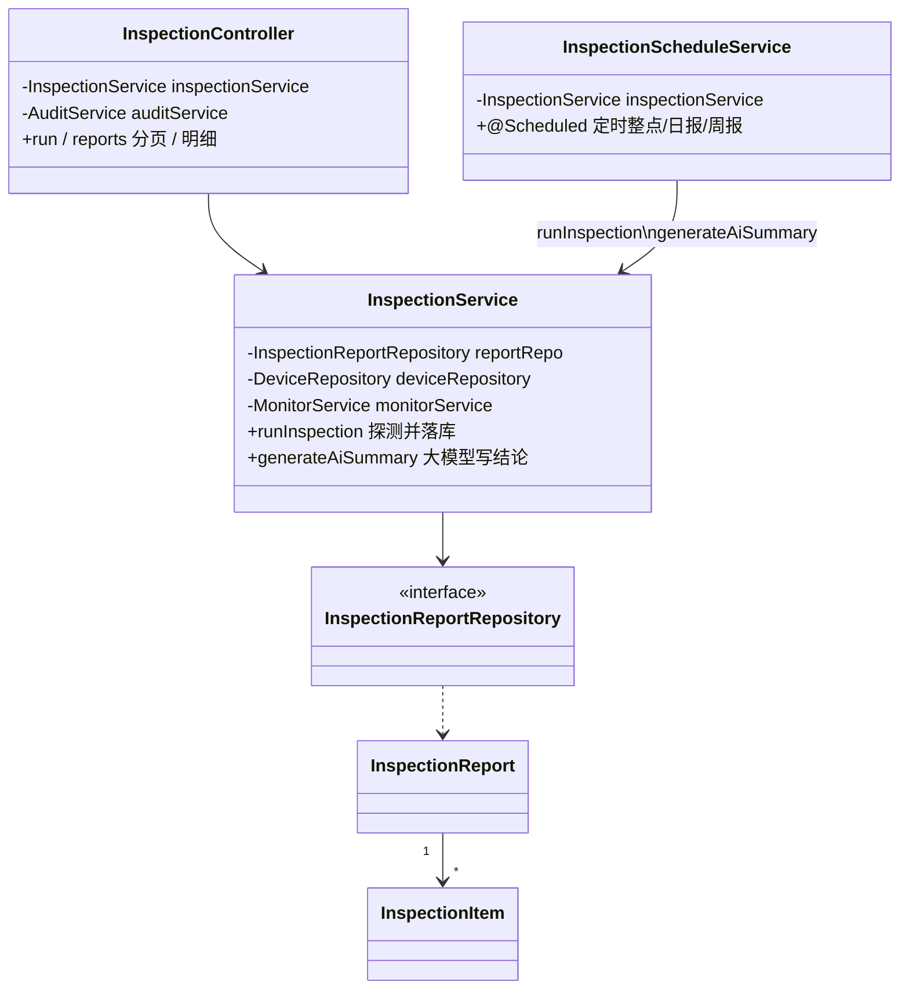
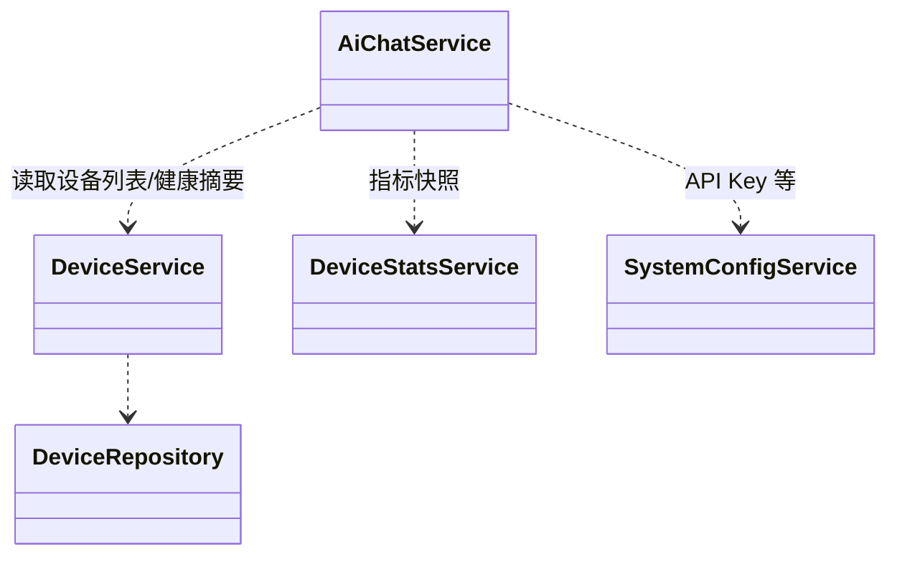

# NetPulse 毕业设计 — 后端类图（Mermaid）

与当前 `NetPulse` 工程 **Spring Boot 分层**一致：控制器（表现层）→ 服务层（业务）→ 数据访问层（持久）→ 实体。  
将代码块复制到 [mermaid.live](https://mermaid.live) 可导出 **PNG/SVG** 插入 Word。

---

## 1 总体分层与依赖关系（论文总览图）

**更直观的依赖链（简化类名）**：

---

## 2 设备管理模块核心类

---

## 3 告警模块核心类

**说明**：`AlertController` 对部分仓储**直接注入**做查询与简单更新；复杂评估逻辑在 `AlertService` 中，由定时任务或状态变更调用。

---

## 4 认证与用户模块核心类

---

## 5 AI 运维助手模块核心类

---

## 6 实体层主要类（与数据库表对应）

---

## 7 系统巡检模块核心类

**说明**：AI 结论由 `InspectionService.generateAiSummary` 实现（内部调用 `AiChatService` 等），与 `AiChatController` 的 `/ai/inspection-summary` 复用同一套逻辑；探测与 `MonitorService` 状态判定一致。

---

## 8 跨模块依赖示例（AiChatService → DeviceService）

---

## 导出与论文使用说明

1. **导出图片**：https://mermaid.live → 粘贴某一节 `classDiagram` 或 `flowchart` → Export PNG/SVG。  
2. **图过大**：拆成「2 设备」「3 告警」等多张图分别插入第 4～5 章。  
3. **与代码一致**：若后续重构类名，以 `org.ops.netpulse` 包下源码为准，再微调本文档。  
4. **draw.io**：类图更习惯用 **PlantUML / StarUML / IDEA UML**；若必须用 draw.io，可用「软件 → UML」类图形状手绘，关系参考本文档。

---

## 相关文件

- 数据库 ER：`全局ER图-含属性.md`、`NetPulse-全局ER图.drawio`  
- 流程图：`论文-流程图-Mermaid合集.md`  
- 表字段：`后端与数据库表结构对照.md`
