# 论文图示汇总：ER 图、流程图、数据库表图、系统架构功能图

本文档汇总毕业设计论文所需的各类图示，均提供 **Mermaid** 源码，可在 VS Code（安装 Mermaid 插件）、Typora 或 [mermaid.live](https://mermaid.live) 中预览或导出 **PNG/SVG** 后插入 Word/PPT。

---

## 一、系统架构图（总体架构）

系统采用**前后端分离 B/S 架构**：用户层 → 表现层（前端）→ 业务层（后端）→ 数据层 / 外部系统。

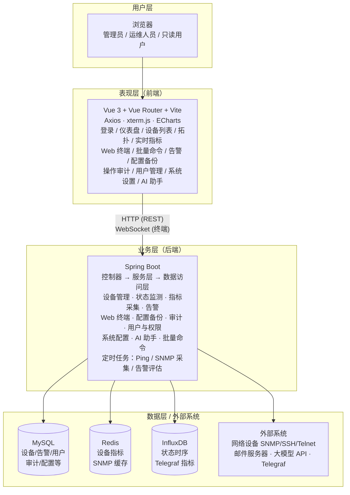

> **说明**：当前实现为 **REST + WebSocket**，持久化使用 MySQL / Redis / InfluxDB；异步任务由 Spring `@Scheduled` / `@Async` 等完成。

---

## 二、系统功能架构图（功能模块）

按**功能**划分：核心业务 + 支撑功能。

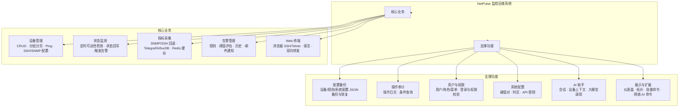

---

## 三、E-R 图（实体联系图）

核心实体及关系，含主键与关键属性。完整版（含全部属性）见 **docs/全局ER图-含属性.md**。

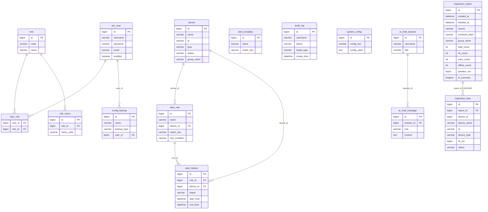

> **说明**：`inspection_item.device_id` 与 `device.id` 为**逻辑关联**（便于展示），库表未建外键；`alert_template` 无外键。

---

### 三.1 数据库表关系图（仅联系与基数，字段从简）

下图突出**表与表之间的参照关系**，适合论文「数据库概念结构」中单列一页；完整属性见 **全局ER图-含属性.md**。

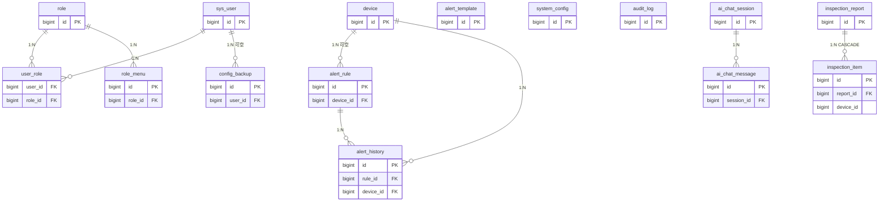

---

## 四、数据库表结构图（按业务分组的字段框图）

各表以框图形式列出，便于论文中“数据库表图”的排版。详细字段见 **docs/后端与数据库表结构对照.md**。

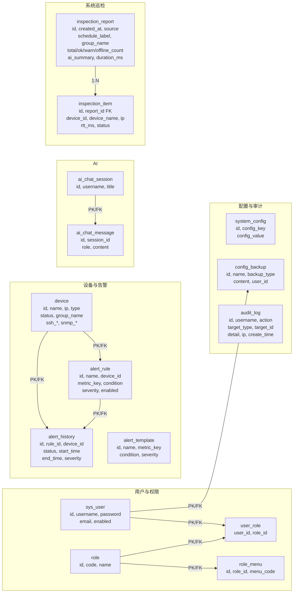

> **说明**：上图为「**表结构总览**」——按业务域分组的**主要字段**示意；与 Flyway 迁移、JPA 实体一致。`inspection_item.device_id` 与 `device` 表为逻辑对应（无库级外键）。详细逐表字段见 **后端与数据库表结构对照.md**。

---

### 四.1 数据库表结构图（核心表字段明细，论文附录可用）

下列按**单表**列出常用字段，便于附录「数据字典」缩略图。

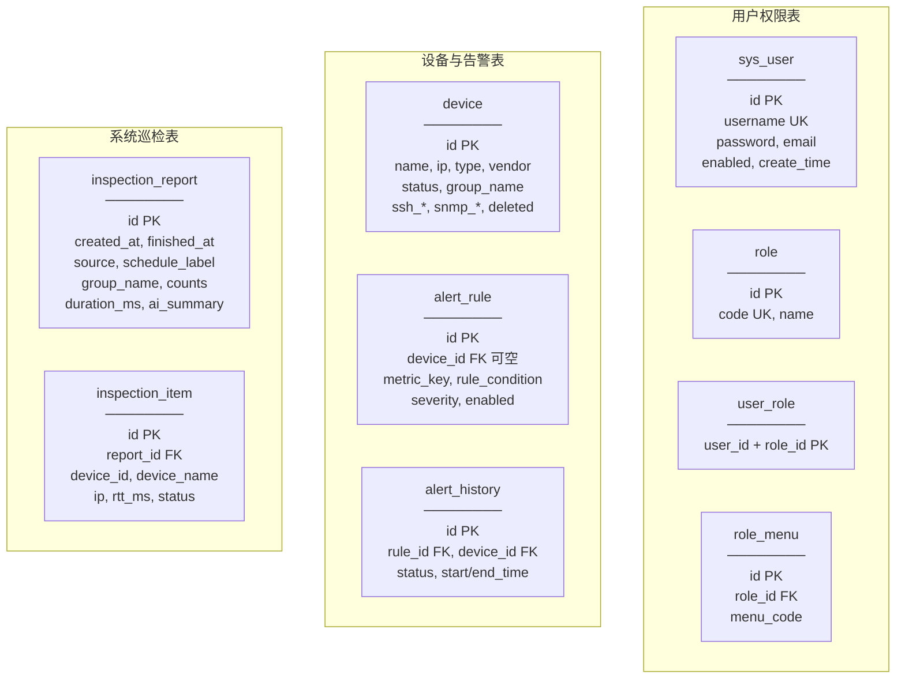

---

## 五、业务流程图

### 5.1 用户登录与权限校验流程

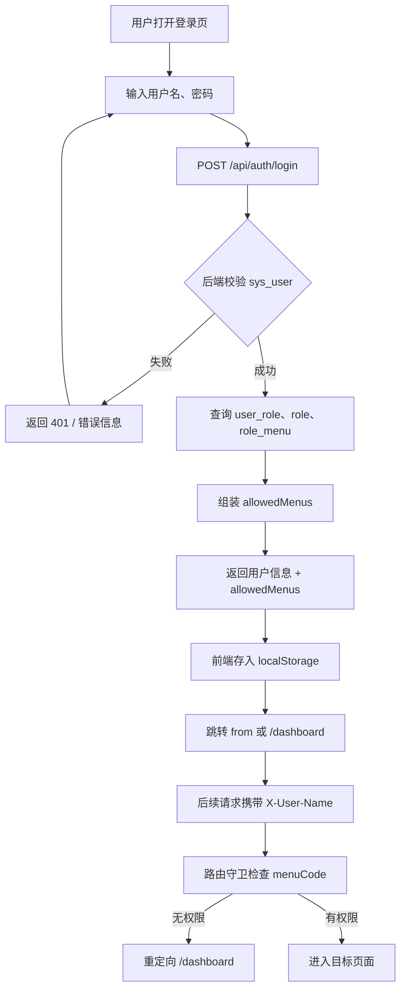

### 5.2 设备状态监测流程

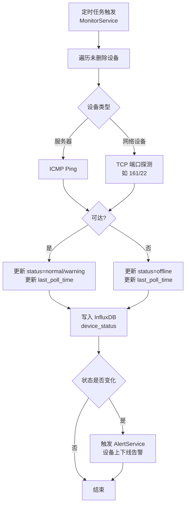

### 5.3 告警规则评估流程

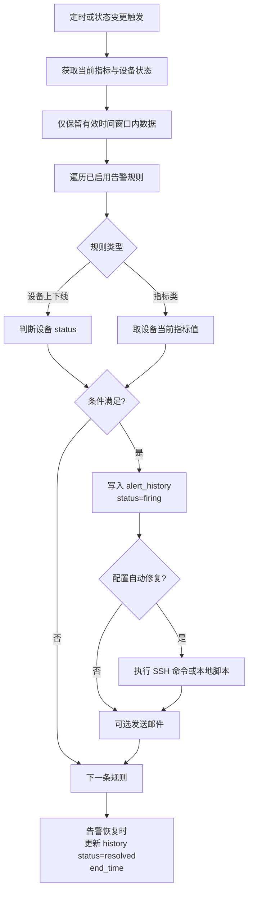

### 5.4 系统巡检流程（探测与可选 AI）

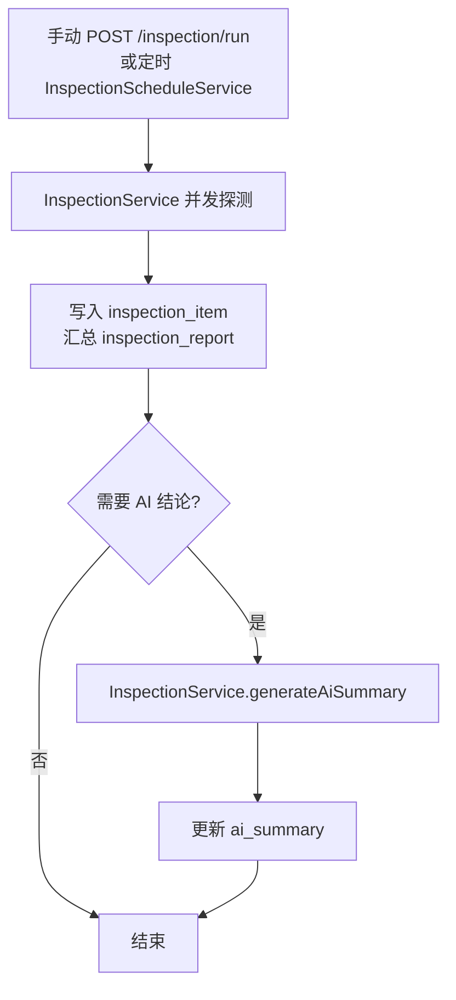

> 与 `论文-流程图-Mermaid合集.md` 第 **7** 节一致。

### 5.5 Web SSH 连接与数据转发流程

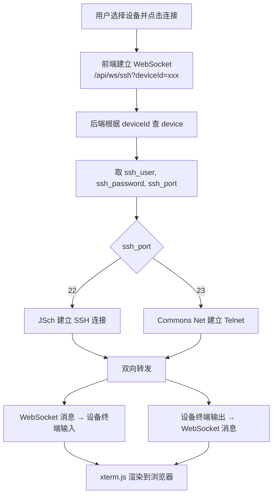

### 5.6 实时指标数据流

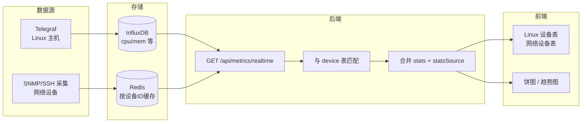

---

## 六、后端与数据层关系简图

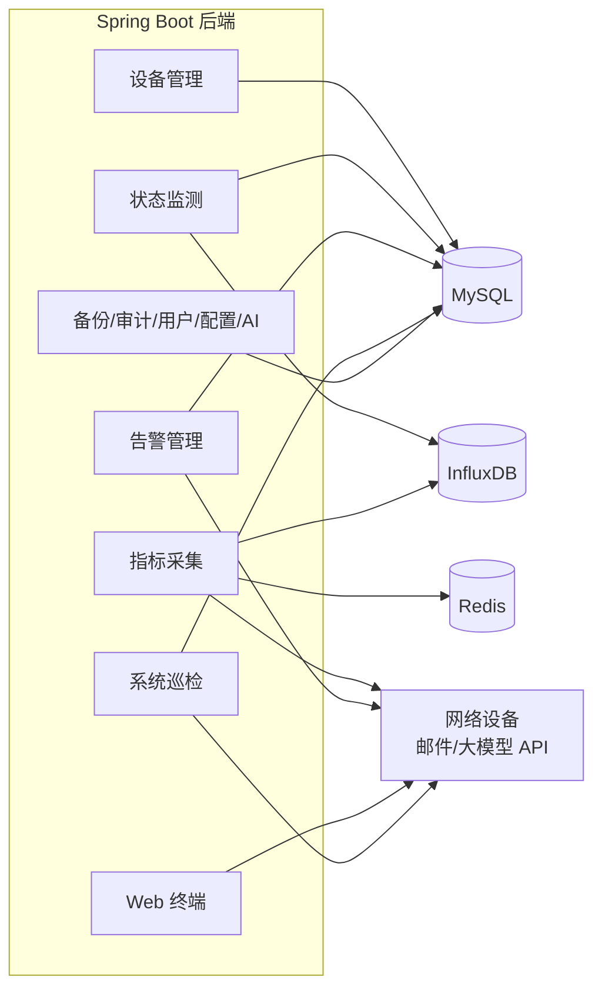

---

## 七、图示与论文章节对应

| 图示类型       | 建议论文章节 | 本文档位置           |
|----------------|--------------|----------------------|
| 系统架构图     | 第 4 章 系统设计 | 一、系统架构图；**draw.io** docs/NetPulse-系统架构图.drawio（页「1-总体架构」） |
| 系统功能架构图 | 第 4 章 系统设计 | 二、系统功能架构图；另见 论文-功能模块图.md；**draw.io** 同上文件（页「2-功能架构」） |
| 功能模块图（菜单树） | 第 3～4 章 需求/设计 | docs/论文-功能模块图.md |
| E-R 图（含属性） | 第 4 章 数据库设计 | 三、E-R 图；详见 **全局ER图-含属性.md** |
| **数据库表关系图**（外键/基数） | 第 4 章 数据库设计 | **三.1**（仅联系、字段从简） |
| **数据库表结构图**（分组字段框图） | 第 4 章 数据库设计 / 附录 | **四**（总览）、**四.1**（核心表明细） |
| 类图（分层/模块） | 第 4～5 章 设计/实现 | docs/论文-类图-Mermaid合集.md |
| 活动图         | 第 4～5 章 设计/实现 | docs/论文-活动图-Mermaid合集.md |
| 功能流程图（draw.io 含判断，六页） | 第 4～5 章 | **draw.io** docs/NetPulse-功能流程图-完整版.drawio：页「**0-系统功能全流程（含登录）**」总览 +「1-登录与权限」～「5-实时指标数据流」分模块；另见 docs/论文-流程图-Mermaid合集.md |
| 业务流程图     | 第 4 章 系统设计 / 第 5 章 实现 | 五、业务流程图       |
| 后端与数据层图 | 第 4 章 系统设计 | 六、后端与数据层关系简图 |

---

## 八、导出为图片步骤

1. **VS Code**：安装 “Mermaid” 或 “Markdown Preview Mermaid Support”，在预览中查看。
2. **在线导出**：打开 [mermaid.live](https://mermaid.live)，将上述任意代码块内容（**不含** \`\`\`mermaid 首尾标记）粘贴到左侧，右侧即渲染；点击 “Actions” → “Export” 可导出 **PNG** 或 **SVG**。
3. **插入 Word/PPT**：导出 PNG 或 SVG 后插入论文或答辩 PPT；若学校要求 Visio/draw.io 绘制，可参照本文档文字与 **docs/系统功能架构图说明.md**、**docs/全局ER图-含属性.md** 中“实体与关系说明”手绘。

---

## 九、相关文档索引

- **系统架构图（总体分层 + 功能架构，draw.io 双页）**：docs/NetPulse-系统架构图.drawio  
- **功能流程图（draw.io 六页含菱形分支）**：docs/NetPulse-功能流程图-完整版.drawio（**0-系统功能全流程（含登录）** · 1-登录与权限 · 2-设备状态监测 · 3-告警规则评估 · 4-Web终端与转发 · 5-实时指标数据流）；Mermaid 合集 docs/论文-流程图-Mermaid合集.md；简化 draw.io docs/NetPulse-流程图-毕业设计.drawio  
- **功能模块图（菜单分组 + 业务核心/支撑，Mermaid + draw.io）**：docs/论文-功能模块图.md、docs/NetPulse-功能模块图.drawio  
- **活动图（控制流/泳道，Mermaid）**：docs/论文-活动图-Mermaid合集.md  
- **类图（后端分层与模块依赖，Mermaid + draw.io 分层示意）**：docs/论文-类图-Mermaid合集.md、docs/NetPulse-类图-分层示意.drawio  
- **ER 实体关系（基数、外键、总表）**：docs/论文-ER图-实体关系一览.md  
- **论文专用：分模块 ER + 表结构框图 + 可引用正文段落**：docs/论文-数据库图示专篇-ER与表结构图.md  
- **系统功能架构图（多图）**：docs/系统功能架构图.md  
- **E-R 图完整版（含全部属性）**：docs/全局ER图-含属性.md  
- **数据库表字段对照**：docs/后端与数据库表结构对照.md  
- **系统功能架构图说明（文字框图）**：docs/系统功能架构图说明.md  
